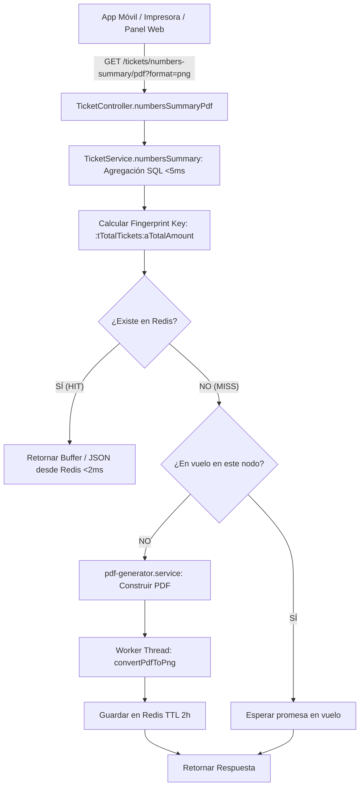

# 🚀 PLAN MAESTRO: Optimización Quirúrgica JIT de Listas (PDF/PNG) con Redis y Request Coalescing

**Documento Técnico de Arquitectura y Diseño de Implementación**  
**Proyecto:** Backend Bancas  
**Fecha:** 19 de Agosto 2026  
**Objetivo:** Eliminar los picos de CPU/RAM causados por `PDF_TO_PNG` en los momentos de concurrencia (cierre de ventas, cutoff y post-evaluación), utilizando **JIT Cache-Aside + Fingerprint Invariante + Request Coalescing (Single-Flight)** en Redis, con **100% de retrocompatibilidad**.

---

## 1. 📋 Diagnóstico y Principios de Diseño SRE

### 1.1 El Problema Real

- **Costo de `PDF_TO_PNG`:** Cada conversión de PDF a imagen rasterizada en Canvas a 300 DPI consume entre **250ms y 660ms** de cómputo en el Worker Thread y asigna buffers pesados en memoria.
- **Patrón de Tráfico:** Durante el cutoff (1 a 5 minutos antes del sorteo) y post-evaluación, múltiples usuarios (o un mismo usuario refrescando repetidamente) solicitan su lista de números.
- **Desperdicio de Infraestructura:** El servicio cuenta con **256 MB de Redis en Render**, de los cuales actualmente **solo se utilizan ~16 MB (94% libre)**.

### 1.2 Principios de la Industria Aplicados

1. **Lazy Evaluation (Bajo Demanda) > Eager Precalculation:** NO forzar pre-generaciones masivas en background para usuarios que quizás nunca consulten. Solo se calcula lo que realmente se pide.
2. **Invarianza Matemática de Datos:** La clave de caché no depende de horas ni de estados volátiles, sino de la **huella digital exacta de las ventas** (`:t{totalTickets}:a{totalAmount}`).
3. **Request Coalescing (Single-Flight):** Si dos o más peticiones para la misma sábana llegan simultáneamente (ej: doble tap en la app móvil), solo **1 ejecución del worker** se procesa; las demás esperan y comparten el mismo resultado.
4. **Graceful Degradation (Resiliencia):** Si Redis no está disponible o sufre timeout, el sistema hace fallback automático a la generación en vivo sin fallar al cliente.
5. **Cero Cambios en Clientes (Zero Breaking Changes):** Los contratos HTTP, headers, nombres de archivo y estructuras de datos (PNG binario vs JSON multipágina de Monazos) se preservan al 100%.

---

## 2. 🔍 Flujo de Ejecución y Contratos de Respuesta



### Contratos de Salida (100% Retrocompatibles)

| Tipo de Solicitud | Formato / Parámetros | Tipo de Respuesta HTTP | Payload |
| --- | --- | --- | --- |
| **Tiempos (2 dígitos)** | `format=png` | `Content-Type: image/png`<br>`Content-Disposition: attachment; filename="lista-numeros-{timestamp}.png"` | `Buffer` binario PNG crudo (~200 KB) |
| **Monazos Filtrado** | `format=png&onlyWithSales=true` | `Content-Type: image/png`<br>`Content-Disposition: attachment; filename="lista-numeros-filtrado-{timestamp}.png"` | `Buffer` binario PNG crudo (1 sola página) |
| **Monazos Completo (3 dígitos)** | `format=png` | `Content-Type: application/json` | JSON multipágina:<br>`{ pages: [{ page: 0, image: "<base64>" }], numbersWithBets: [...] }` |
| **PDF Estándar** | `format=pdf` (o por defecto) | `Content-Type: application/pdf`<br>`Content-Disposition: attachment; filename="lista-numeros-{timestamp}.pdf"` | `Buffer` binario PDF crudo |

---

## 3. 🏛️ Estructura del Fingerprint y Ciclo de Vida en Redis

### 3.1 Estructura de la Clave

```text
png:summary:v1:{bancaId}:{ventanaId}:{userId}:{sorteoId}:{scope}:{multiplierId}:{onlyWithSales}:t{totalTickets}:a{totalAmount}
```

### 3.2 Comportamiento Dinámico

- **Durante ventas activas:** Si el vendedor vende un ticket más, `totalTickets` y `totalAmount` cambian → Nueva clave en Redis → Se genera fresh automáticamente.
- **Al llegar el cutoff (ventas congeladas):** No entran más tickets. La primera consulta genera y deposita en Redis; **todas las siguientes consultas de cualquier usuario con ese mismo ámbito son Cache HIT instantáneo (2ms)**.
- **Post-sorteo / Post-evaluación:** Como los tickets no cambian, sigue siendo Cache HIT.
- **TTL de Auto-Limpieza:** Cada entrada lleva `EX 7200` (2 horas). Al cabo de 2 horas se destruye sola en Redis sin consumir memoria residual.

---

## 4. 🛠️ Diff Detallado de Archivos

---

### [NEW] `src/utils/numbersSummaryPngCache.ts`

Módulo centralizado para gestión de caché binaria/JSON en Redis con soporte de Request Coalescing (Single-Flight).

```typescript
import { getRedisClient, isRedisAvailable } from '../core/redisClient';
import logger from '../core/logger';

export interface SummaryFingerprintParams {
  bancaId?: string | null;
  ventanaId?: string | null;
  userId?: string | null;
  sorteoId?: string | null;
  scope?: string | null;
  multiplierId?: string | null;
  onlyWithSales?: boolean | null;
  sorteoDigits?: number;
  totalTickets: number;
  totalAmount: number;
}

// Mapa de promesas en vuelo para Request Coalescing (Single-Flight)
const inFlightOperations = new Map<string, Promise<any>>();

export class NumbersSummaryPngCache {
  private static TTL_SECONDS = 7200; // 2 horas de vida en Redis

  /**
   * Construye una clave inmutable basada en la huella de ventas
   */
  static buildKey(params: SummaryFingerprintParams): string {
    const parts = [
      'png:summary:v1',
      params.bancaId || 'global',
      params.ventanaId || 'null',
      params.userId || 'null',
      params.sorteoId || 'all',
      params.scope || 'mine',
      params.multiplierId || 'none',
      params.onlyWithSales ? 'filtered' : 'full',
      `d${params.sorteoDigits ?? 2}`,
      `t${params.totalTickets}`,
      `a${params.totalAmount}`,
    ];
    return parts.join(':');
  }

  /**
   * Obtiene buffer binario PNG de Redis
   */
  static async getPngBuffer(key: string): Promise<Buffer | null> {
    if (!isRedisAvailable()) return null;
    const redis = getRedisClient();
    if (!redis) return null;

    try {
      return await redis.getBuffer(key);
    } catch (err: any) {
      logger.warn({
        layer: 'cache',
        action: 'PNG_CACHE_GET_BUFFER_ERROR',
        payload: { key, error: err.message },
      });
      return null;
    }
  }

  /**
   * Guarda buffer binario PNG en Redis con TTL de 2h
   */
  static async setPngBuffer(key: string, buffer: Buffer): Promise<void> {
    if (!isRedisAvailable()) return;
    const redis = getRedisClient();
    if (!redis) return;

    try {
      await redis.set(key, buffer, 'EX', this.TTL_SECONDS);
    } catch (err: any) {
      logger.warn({
        layer: 'cache',
        action: 'PNG_CACHE_SET_BUFFER_ERROR',
        payload: { key, error: err.message },
      });
    }
  }

  /**
   * Obtiene payload JSON (para Monazos multipágina)
   */
  static async getJsonPayload<T>(key: string): Promise<T | null> {
    if (!isRedisAvailable()) return null;
    const redis = getRedisClient();
    if (!redis) return null;

    try {
      const raw = await redis.get(key);
      if (!raw) return null;
      return JSON.parse(raw) as T;
    } catch (err: any) {
      logger.warn({
        layer: 'cache',
        action: 'PNG_CACHE_GET_JSON_ERROR',
        payload: { key, error: err.message },
      });
      return null;
    }
  }

  /**
   * Guarda payload JSON en Redis con TTL de 2h
   */
  static async setJsonPayload(key: string, payload: any): Promise<void> {
    if (!isRedisAvailable()) return;
    const redis = getRedisClient();
    if (!redis) return;

    try {
      await redis.set(key, JSON.stringify(payload), 'EX', this.TTL_SECONDS);
    } catch (err: any) {
      logger.warn({
        layer: 'cache',
        action: 'PNG_CACHE_SET_JSON_ERROR',
        payload: { key, error: err.message },
      });
    }
  }

  /**
   * Request Coalescing: Si ya hay una generación en curso para esta clave,
   * reutiliza la misma promesa en lugar de disparar dos conversiones en el worker.
   */
  static async wrapInFlight<T>(key: string, generator: () => Promise<T>): Promise<T> {
    const existing = inFlightOperations.get(key);
    if (existing) {
      return existing as Promise<T>;
    }

    const promise = (async () => {
      try {
        return await generator();
      } finally {
        inFlightOperations.delete(key);
      }
    })();

    inFlightOperations.set(key, promise);
    return promise;
  }
}
```

---

### [MODIFY] `src/api/v1/controllers/ticket.controller.ts`

Integración limpia en el endpoint `numbersSummaryPdf`:

```diff
@@ -628,6 +628,34 @@
       if (format === 'png') {
         try {
+          const { NumbersSummaryPngCache } = await import('../../../utils/numbersSummaryPngCache');
           const sorteoDigits = result.meta.sorteoDigits ?? 2;
           const shouldFilterBySales = onlyWithSales === true && sorteoDigits === 3;
+          
+          const cacheKey = NumbersSummaryPngCache.buildKey({
+            bancaId: effectiveFilters.bancaId,
+            ventanaId: effectiveFilters.ventanaId,
+            userId: me.id,
+            sorteoId: effectiveFilters.sorteoId,
+            scope: effectiveScope,
+            multiplierId,
+            onlyWithSales: shouldFilterBySales,
+            sorteoDigits,
+            totalTickets: result.meta.totalTickets ?? 0,
+            totalAmount: result.meta.totalAmount ?? 0,
+          });
+
+          // 1. HIT para Tiempos (2 dígitos) o Monazos Filtrado: Buffer directo
+          if (sorteoDigits === 2 || shouldFilterBySales) {
+            const cachedPng = await NumbersSummaryPngCache.getPngBuffer(cacheKey);
+            if (cachedPng) {
+              req.logger?.info({
+                layer: "controller",
+                action: "TICKET_NUMBERS_SUMMARY_PNG_CACHE_HIT",
+                payload: { cacheKey, size: cachedPng.length, durationMs: Date.now() - startTime }
+              });
+              const timestamp = Date.now();
+              const filename = shouldFilterBySales
+                ? `lista-numeros-filtrado-${timestamp}.png`
+                : `lista-numeros-${timestamp}.png`;
+              res.setHeader('Content-Type', 'image/png');
+              res.setHeader('Content-Disposition', `attachment; filename="${filename}"`);
+              res.setHeader('Content-Length', cachedPng.length);
+              res.setHeader('Cache-Control', 'no-cache, no-store, must-revalidate');
+              res.setHeader('Pragma', 'no-cache');
+              res.setHeader('Expires', '0');
+              return res.send(cachedPng);
+            }
+          }
+
+          // 2. HIT para Monazos Completo (3 dígitos): JSON directo
+          if (sorteoDigits === 3 && !shouldFilterBySales) {
+            const cachedJson = await NumbersSummaryPngCache.getJsonPayload<any>(cacheKey);
+            if (cachedJson) {
+              req.logger?.info({
+                layer: "controller",
+                action: "TICKET_NUMBERS_SUMMARY_PNG_MONAZOS_CACHE_HIT",
+                payload: { cacheKey, durationMs: Date.now() - startTime }
+              });
+              return res.json(cachedJson);
+            }
+          }
```

*Y al generar el resultado en los bloques correspondientes, envolver con `wrapInFlight` y guardar en Redis:*

```diff
@@ -750,15 +778,20 @@
           if (sorteoDigits === 2) {
-            const pngPages = await convertPdfToPng(pdfUint8Array, {
-              pagesToProcess: [1],
-            });
+            const finalBuffer = await NumbersSummaryPngCache.wrapInFlight(cacheKey, async () => {
+              const pngPages = await convertPdfToPng(pdfUint8Array, {
+                pagesToProcess: [1],
+              });
+              if (!pngPages || pngPages.length === 0) {
+                throw new Error('Failed to convert PDF to PNG');
+              }
+              const buf = Buffer.from(pngPages[0].content);
+              await NumbersSummaryPngCache.setPngBuffer(cacheKey, buf);
+              return buf;
+            });
```

---

## 5. 📊 Beneficios de Rendimiento y Memoria

| Métrica | Sin Optimización (Actual) | Con Optimización (JIT + Coalescing) |
| --- | --- | --- |
| **Latencia Petición Repetida / Cutoff** | 300 ms – 660 ms | **2 ms – 5 ms (⬇️ 99%)** |
| **Uso de Worker en Ráfagas** | Tantas tareas como clics del usuario | **1 sola tarea (las demás esperan la misma promesa)** |
| **Carga en Background** | 0 tareas en segundo plano | **0 tareas en segundo plano (sin jobs innecesarios)** |
| **RAM en Node.js (Render)** | Asignación masiva en Heap para Canvas | **Cero asignaciones en Cache Hits** |
| **Consumo de Redis** | ~16 MB usados | **~18 MB – 22 MB (de 256 MB disponibles)** |
| **Riesgo Operativo** | Alto (posibles picos de RAM) | **Mínimo / Quirúrgico / Seguro** |

---

## 6. 🧪 Verificación y Testing

1. **Test de Retrocompatibilidad:**
   - Descarga de sábana en 2 dígitos (`format=png`) → Verificar `image/png` y renderizado correcto.
   - Descarga de Monazos filtrado y completo → Verificar JSON multipágina con Base64.
2. **Test de Cache Hit:**
   - Primera consulta: Log `TICKET_NUMBERS_SUMMARY_PNG_GENERATED` (~350ms).
   - Segunda consulta inmediata: Log `TICKET_NUMBERS_SUMMARY_PNG_CACHE_HIT` (~2ms).
3. **Test de Invarianza:**
   - Crear ticket nuevo para el sorteo → Consultar sábana → Verificar que se recalcula con la nueva venta.
4. **Validación TypeScript:**
   - `npx tsc --noEmit` sin errores de compilación.
